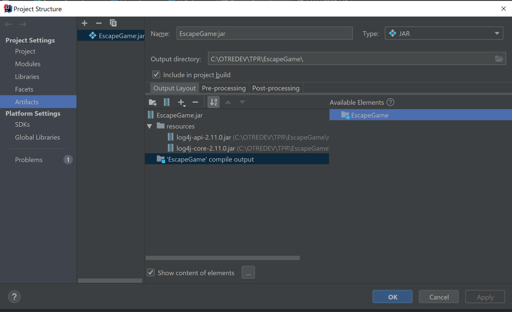
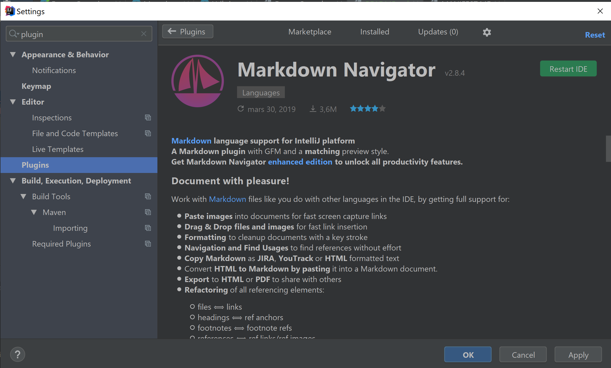

# Configurer la génération du fichier JAR
- Il est est nécessaire de configurer la génération d'un artifact comme ceci :
cf image ici : /doc/images/Artifact_configuration_for_archive_JAR.png

**Note** : Pour la voir dans le fichier README.md : télécharger le plugin "Markdown navigator"

Aide Markdown : https://fr.wikipedia.org/wiki/Markdown
